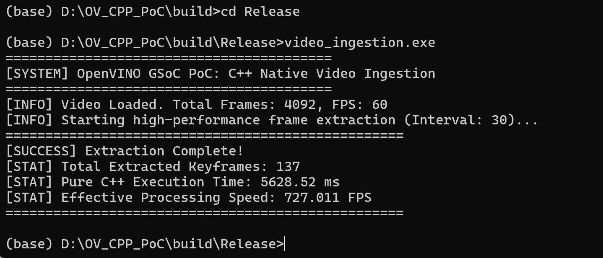

# GSoC 2026 PoC: C++ Native Multimodal Ingestion Engine

This repository contains a standalone **Proof of Concept (PoC)** developed for the OpenVINO GSoC 2026 project: *Deep Search AI Assistant on Multimodal Personal Database for AIPC*.

## 🎯 Motivation
While evaluating the Python-based (`cv2`) video ingestion pipeline for local AI RAG systems, I observed severe **Memory Bloat** and **CPU/GIL blocking** (processing 4000+ frames took ~11 minutes at 0.5 FPS). 
To address the "huge development work" of C++ architecture expected by the mentors, I built this native C++ ingestion frontend to bypass Python entirely.

## 🚀 Benchmark Results (Local AIPC)
* **Hardware:** Lenovo Yoga 16s Pro (Intel Core Ultra 9 185H)
* **Task:** Keyframe extraction at interval=30 (2.0 FPS effective sampling density).
* **Result:** Extracted frames stably with RAII memory management in **5.62 seconds**, achieving **727 FPS**.



## 🛠️ Build Instructions
```bash
mkdir build && cd build
cmake ..
cmake --build . --config Release
